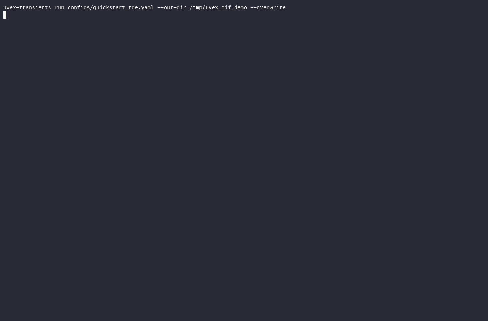

<p align="center">
  
</p>


<h1 align="center">UVEX Transients</h1>

<p align="center"><em>End-to-end simulations of transients from UVEX all-sky surveys.</em></p>

<p align="center">
  
  
  
</p>

---

**UVEX Transients** provides spectral and light-curve models for several transient classes
(kilonovae, tidal disruption events, luminous fast blue optical transients, supernovae), built on
a common cosmologically-aware SED framework, and tools to Monte Carlo sample populations of these
transients against a real survey schedule to produce an event catalog of detections.

## Installation

```bash
pip install uvex-transients
```

Or install from source:

```bash
git clone https://github.com/TransientsExtragalactic/uvex-transients
cd uvex-transients && pip install -e .
```

## Quickstart

The `uvex-transients` CLI drives the full simulation pipeline (sample events, screen by
magnitude/SNR, run synthetic photometry) from a single YAML config file. Try it against the
bundled [`configs/quickstart_tde.yaml`](configs/quickstart_tde.yaml) example:

```bash
uvex-transients run configs/quickstart_tde.yaml --out-dir results/quickstart/
```

<p align="center">
  
</p>

See the file itself for what each section does, and `uvex-transients --help` for every command.
[`configs/full_run.yaml`](configs/full_run.yaml) is a full-scale config covering every registered
transient class at once; run it directly or via `make run` (see the [`Makefile`](Makefile) --
`make help` lists every target).

If you'd rather work interactively, [`notebooks/`](notebooks/) has one self-contained, end-to-end
notebook per transient family (kilonovae, TDEs, LFBOTs, Type II supernovae -- IIP, IIP + early
excess and IIb together -- and Type I supernovae -- Ib and Ic); run them with `make notebooks` or
open them directly in Jupyter.

Full documentation, including the API reference, is available in the [`docs/`](docs/) directory.

---

<p align="center">
  
  &nbsp;&nbsp;&nbsp;
  
</p>
